# AI SRE Kubernetes Agent

Evidence-driven AI-assisted Kubernetes incident diagnosis and remediation with deterministic safety controls, bounded automation, human approval, and verifiable operational evidence.

## Why this project exists

Jane leads an SRE team responsible for deploying and operating a growing portfolio of client-facing applications running on Kubernetes. Each application has a different operational profile: resource requirements, traffic patterns, active user base, dependencies, and failure modes.

Her team already has strong observability in place. Metrics, logs, health checks, Kubernetes events, and alerts provide precise operational signals when something goes wrong. But when an incident occurs, engineers still spend significant time correlating those signals, reconstructing what changed, distinguishing symptoms from root causes, and repeatedly working through familiar diagnostic procedures across many Pods and services.

Jane starts asking a different question:

> What if the observability layer could do more than collect telemetry and trigger alerts? What if it could also reason over operational evidence, form an explainable diagnosis, and determine the safest next step?

For low-risk situations, perhaps the system could recognize that Kubernetes has already recovered and simply verify the outcome. When the evidence strongly points to a recent deployment regression, it might safely perform a tightly constrained automatic rollback. And when the evidence is incomplete or the proposed action carries greater risk, it could stop and ask an engineer for approval.

This project explores that idea: augmenting traditional Kubernetes observability with LLM-powered reasoning while keeping infrastructure actions evidence-driven, constrained, explainable, and under deterministic safety controls.

<p align="center">
  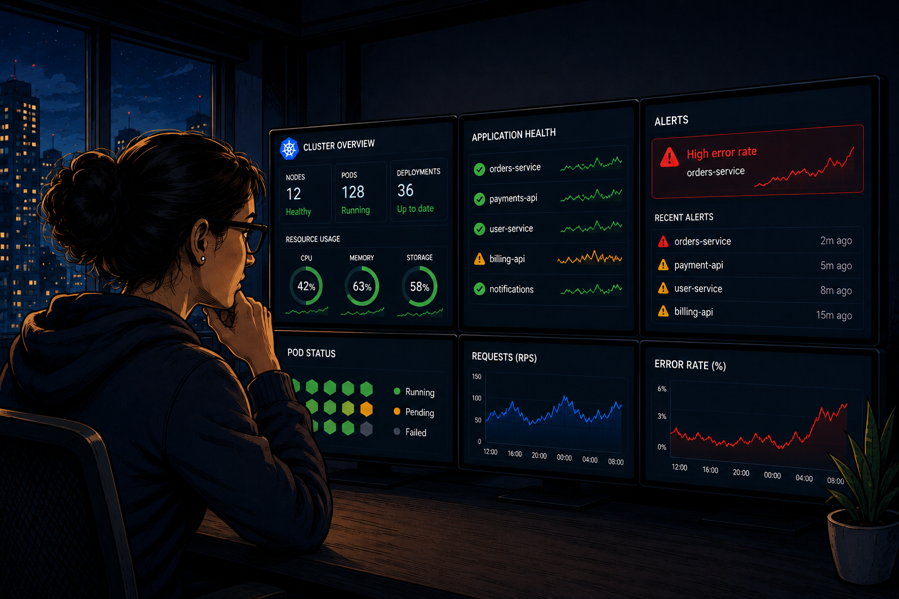
</p>


## Project question

> Can an AI agent system diagnose Kubernetes deployment failures using verifiable operational evidence while remaining safe, explainable, and useful to production engineers?

The project evaluates four dimensions:

- **Diagnostic accuracy**
- **Evidence traceability**
- **Operational safety**
- **Practical usability**

## Core design principle

The LLM is **not** the infrastructure authorization boundary.

<p align="center">
  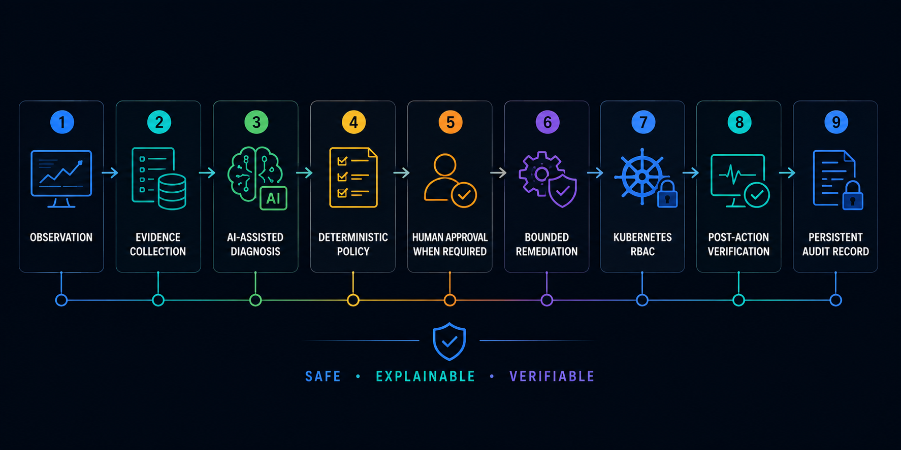
</p>

The degree of automation depends on the strength of the operational evidence and the risk of the proposed action.

## Demonstrated scenarios

| Scenario | Failure | Agent behavior | Authority level |
|---|---|---|---|
| **1 — Kubernetes self-healing** | Application Pod disappears | Detects the disruption and verifies native Kubernetes recovery | Observe only |
| **2 — Deployment regression** | A recent release develops runtime DB-pool exhaustion | Correlates failure with the rollout, evaluates deterministic rollback policy, rolls back, and verifies recovery | Bounded autonomous remediation |
| **3 — Repeated OOMKilled** | Container repeatedly exceeds its 192Mi memory limit | Identifies the observed condition, preserves root-cause uncertainty, and pauses for operator approval | Human-approved remediation |

```text
Scenario 1
Observe → Verify → No action

Scenario 2
Observe → Diagnose → Policy allows → Auto-remediate → Verify

Scenario 3
Observe → Diagnose uncertainty → Policy blocks → Human approves
        → Bounded mitigation → Verify
```

## LangGraph workflow

The project exposes one LangGraph workflow, `sre_agent`, used for both incident processing and conversational investigation.

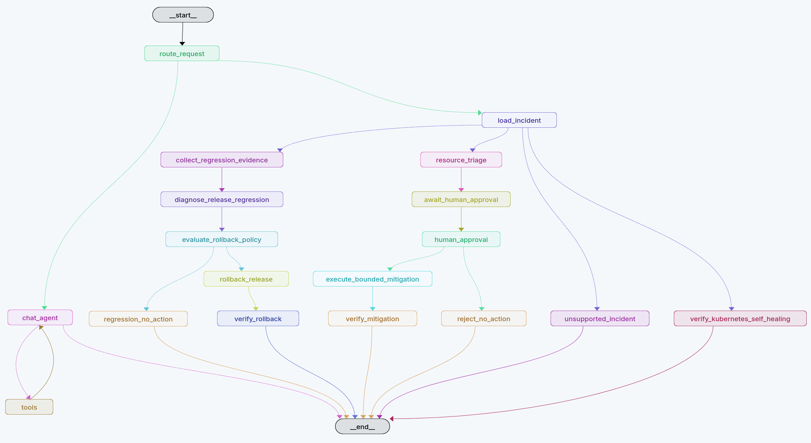

The graph deliberately separates:

- evidence collection from diagnosis,
- AI-assisted diagnosis from deterministic authorization,
- automatic remediation from human-approved remediation,
- remediation from post-action verification,
- conversational read-only investigation from infrastructure write paths.

## Architecture

<p align="center">
  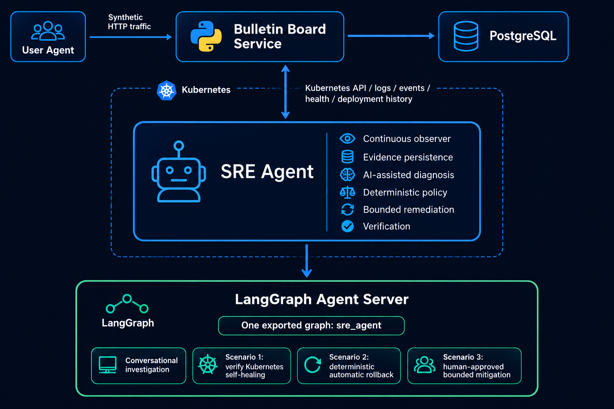
</p>

Other details:
- [Safety model](docs/safety.md)
- [Evidence model](docs/evidence-model.md)
- [Limitations](docs/limitations.md)

## Components

### `bulletin-board-service`

Python/FastAPI application under observation, backed by PostgreSQL. It exposes normal application APIs, liveness/readiness endpoints, and controlled demo fault injection.

Current baseline:

```text
image: bulletin-board-service:0.4.0
memory request: 96Mi
memory limit: 192Mi
```

### `user-agent`

Synthetic traffic generator that calls the bulletin-board API every 3–5 seconds.

The SRE agent deliberately does **not** read `user-agent` logs, metrics, or Kubernetes resources. The traffic generator behaves like an external workload, not an observability source.

Current version: `0.1.0`.

### `sre-agent`

Continuous observer, evidence store, conversational interface, LangGraph workflow, deterministic policy engine, remediation executor, and verification loop.

Current version: **`0.5.2`**.

Version `0.5.2` adds bounded conversational evidence retrieval so a chat request does not inject entire nested incident histories into the model context. The chat branch retrieves compact incident summaries first and fetches bounded detail for a specific incident only when necessary.

---

# Scenario 1 — Observe and verify Kubernetes self-healing

## Failure

A healthy application Pod is manually deleted.

Kubernetes' ReplicaSet controller restores the desired replica count without assistance from the SRE agent.

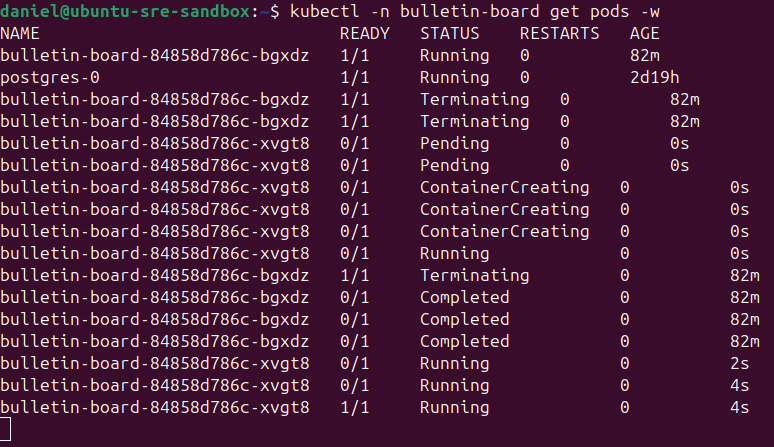

## Agent behavior

The agent records the Pod disappearance, observes the replacement Pod, verifies Deployment health and application readiness, and correctly performs **no write action**.

The persisted result records:

```text
incident: pod_disappearance
status: resolved
self_healed_by: kubernetes
health status: HTTP 200
consecutive successful checks: 2
agent write action executed: false
```

The same evidence can be investigated conversationally through the read-only chat branch:

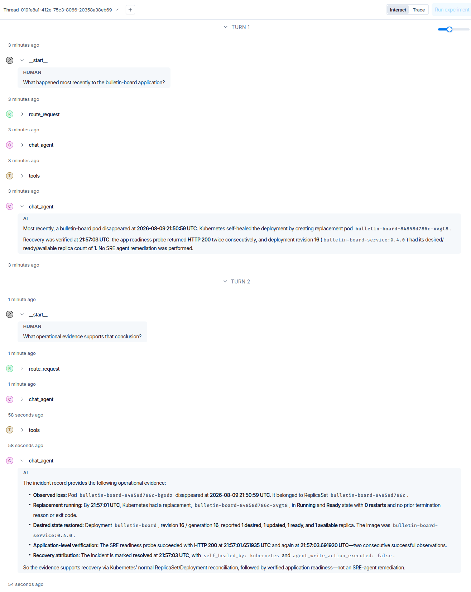

### Result

**Observe → Verify → No action**

This scenario demonstrates that detecting an incident does not imply that the agent should remediate it. Kubernetes had already restored the desired state, so the safest action was no action.

---

# Scenario 2 — Automatically roll back a deployment regression

## Failure

A new application revision, `bulletin-board-service:0.3.0`, initially becomes healthy and then develops a runtime database connection-pool exhaustion failure.

The readiness transition is visible directly:

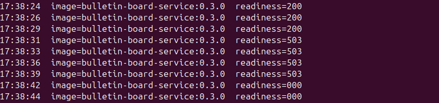

The failure therefore differs from a simple rollout that never starts. The release first passes readiness and then degrades while serving traffic.

## Evidence-driven diagnosis

The SRE workflow correlates the failure with the recent release and gathers revision-scoped evidence:

- the previous `0.4.0` revision had a persistently healthy baseline,
- the new `0.3.0` revision became unready shortly after activation,
- multiple consecutive readiness probes returned `503`,
- the Deployment dropped to `0 ready / 0 available`,
- application logs showed SQLAlchemy `QueuePool` exhaustion,
- PostgreSQL remained `Running` and `Ready` with zero restarts,
- a known-good previous Deployment template was available.

The conversational agent can explain why automatic rollback was allowed:

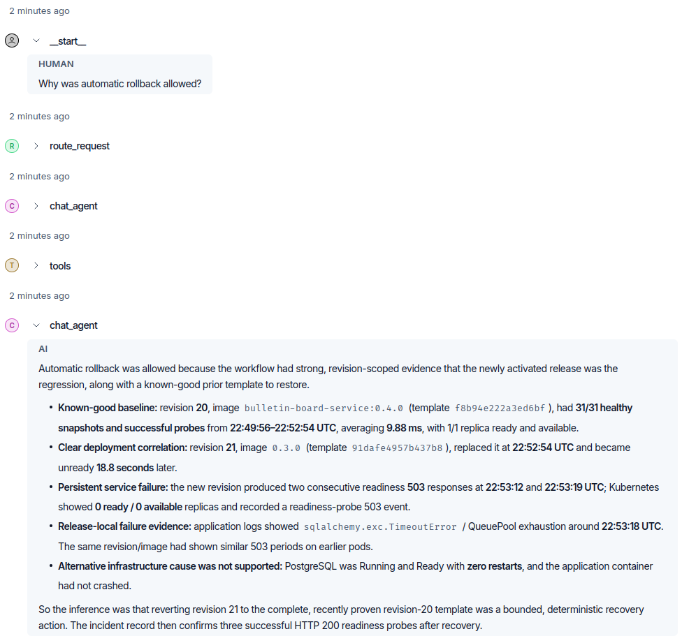

## Deterministic authorization

The diagnosis itself does not authorize a Kubernetes write.

The rollback policy independently requires conditions such as:

```text
recent release
+ enough consecutive failures
+ high-confidence deployment-regression diagnosis
+ previous revision available
+ previous baseline healthy
+ current and previous templates differ
+ PostgreSQL Kubernetes state healthy
+ deployment explicitly allowlisted
+ automatic remediation enabled
= rollback allowed
```

The demonstrated incident passed the deterministic policy and the SRE agent rolled the complete Deployment template back to the known-good revision.

Post-action verification required multiple successful readiness probes before the incident was marked resolved.

### Result

**Observe → Diagnose → Deterministic policy allows → Automatic rollback → Verify**

---

# Scenario 3 — Require human approval when root cause is uncertain

## Failure

A controlled memory-growth fault causes the application container to repeatedly exceed its `192Mi` memory limit.

Kubernetes reports repeated `OOMKilled` events and eventually `CrashLoopBackOff` behavior:

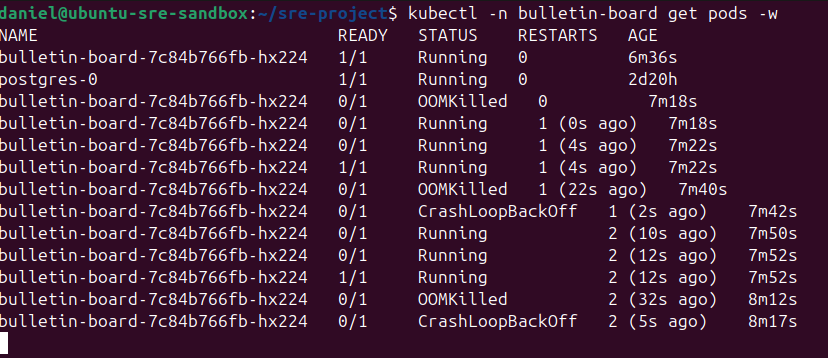

## Evidence and uncertainty

`OOMKilled` and exit code `137` are strong evidence that the container exceeded its memory limit.

They do **not**, however, prove why memory use grew.

The available evidence cannot reliably distinguish among possibilities such as:

- an application memory-growth defect,
- legitimate workload-driven memory demand,
- an undersized memory limit.

The workflow therefore records a high-confidence observed condition while keeping the likely root cause `unknown`.

## Human-in-the-loop safety boundary

Because the evidence does not justify autonomous remediation, deterministic policy blocks automatic action and interrupts the workflow for an operator decision.

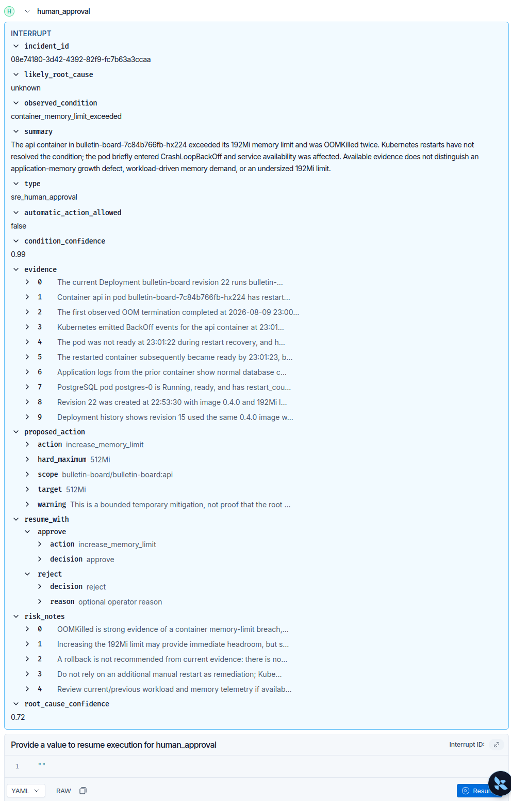

The interrupt exposes:

```text
observed condition: container_memory_limit_exceeded
likely root cause: unknown
automatic action allowed: false
proposed action: increase_memory_limit
current limit: 192Mi
hard maximum: 512Mi
scope: bulletin-board/bulletin-board:api
```

The operator can approve or reject the bounded action.

## Bounded mitigation and verification

After explicit approval, the workflow changes the memory limit from `192Mi` to `512Mi`, waits for the replacement Pod, and verifies application recovery.

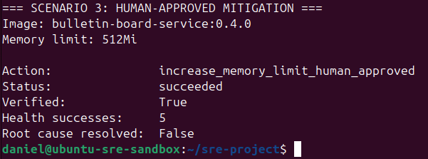

The result intentionally records:

```text
action: increase_memory_limit_human_approved
status: succeeded
verified: true
health successes: 5
root cause resolved: false
```

That distinction matters: **the system records successful mitigation without claiming that the underlying root cause was fixed.**

### Result

**Observe → Diagnose uncertainty → Block autonomous action → Human approval → Bounded mitigation → Verify**

---

# Safety model

The SRE agent uses a dedicated Kubernetes ServiceAccount.

It can read the operational evidence required for the demo in the `bulletin-board` namespace, while its demonstrated write capability is intentionally narrow:

```text
PATCH apps/deployments
resourceName=bulletin-board
```

It cannot:

- delete Pods,
- patch arbitrary Deployments,
- read the `user-agents` namespace,
- expose arbitrary Kubernetes write operations as LLM tools.

Infrastructure writes are deterministic workflow nodes rather than general-purpose model tools.

This creates multiple safety layers:

```text
evidence grounding
      ↓
AI-assisted diagnosis
      ↓
deterministic action policy
      ↓
human approval where required
      ↓
bounded action implementation
      ↓
Kubernetes RBAC
      ↓
post-action verification
      ↓
audit trail
```

# Evidence model

The system can use:

- Pod/container state and restart counts
- previous termination reason and exit code
- Kubernetes Events
- bulletin-board application logs
- Deployment and ReplicaSet history
- resource requests and limits
- application readiness history
- Services and Endpoints
- PostgreSQL Kubernetes health
- incident records
- approval records
- remediation records

The evidence model explicitly separates:

```text
raw observation
      ↓
normalized operational evidence
      ↓
observed condition
      ↓
AI-assisted causal inference
      ↓
condition confidence / root-cause confidence
      ↓
deterministic policy
      ↓
action or escalation
```

An observed fact and an inferred cause are not treated as the same thing.

# Conversational investigation

The read-only chat branch lets an engineer ask questions about incidents after the operational workflow completes.

Examples:

```text
What happened most recently to the bulletin-board application?

What operational evidence supports that conclusion?

Why was automatic rollback allowed?

What evidence supports the conclusion that the new release caused the
failure rather than PostgreSQL?
```

The conversational tools are intentionally bounded:

- `get_incidents` returns compact recent summaries,
- `get_incident_details` retrieves bounded evidence for one incident,
- event, Pod, approval, remediation, log, and revision tools enforce limits,
- every tool response has a hard output-size guard.

The conversational branch has no infrastructure write tools.

# Reproducibility

Useful commands:

```bash
make status
make verify
make reset
make port-forward
make logs
```

Without `make`:

```bash
./demo/verify.sh
./demo/reset.sh
```

Scenario walkthroughs:

- [Scenario 1 — Kubernetes self-healing](demo/scenario-1.md)
- [Scenario 2 — Automatic rollback](demo/scenario-2.md)
- [Scenario 3 — Human-approved OOM mitigation](demo/scenario-3.md)

# SRE API

```text
GET  /health
GET  /incidents
GET  /incidents/{incident_id}
GET  /events
GET  /probe-history
GET  /pod-history
GET  /deployment-history
GET  /remediations
GET  /approvals
POST /chat
```

# Repository structure

```text
.
├── bulletin-board-service/
│   ├── app/
│   ├── k8s/
│   ├── tests/
│   ├── Dockerfile
│   └── VERSION
├── sre-agent/
│   ├── app/
│   ├── k8s/
│   ├── Dockerfile
│   ├── langgraph.json
│   └── VERSION
├── user-agent/
│   ├── app/
│   ├── k8s/
│   ├── Dockerfile
│   └── VERSION
├── demo/
│   ├── scenario-1.md
│   ├── scenario-2.md
│   ├── scenario-3.md
│   ├── reset.sh
│   └── verify.sh
├── docs/
│   ├── images/
│   ├── architecture.md
│   ├── evidence-model.md
│   ├── limitations.md
│   └── safety.md
├── Makefile
└── README.md
```

# Environment

The demonstrated environment uses:

- Linux
- real single-node `kubeadm` Kubernetes cluster
- containerd
- Calico
- PostgreSQL
- Python / FastAPI
- LangGraph
- LangSmith Studio
- OpenAI model

The PostgreSQL manifest references the local development StorageClass `local-path-retain`; replace it if your cluster uses a different StorageClass.

Real credentials are intentionally excluded from the repository. Example Secret manifests are provided; real Secret resources should be created locally.

# Limitations

This is a focused portfolio and research prototype, not a production-ready autonomous operations platform.

Important limitations include:

- single-node Kubernetes environment,
- synthetic application fault injection,
- intentionally narrow incident taxonomy,
- no full metrics stack,
- probabilistic LLM diagnosis,
- confidence values are not formally calibrated,
- narrowly scoped remediation actions,
- development LangGraph Agent Server thread/checkpoint persistence is ephemeral across Pod replacement,
- short verification windows,
- mitigation does not imply root-cause resolution.

See [Limitations](docs/limitations.md) for the complete discussion.

# Conclusion

The experiments do not argue that an LLM should autonomously operate arbitrary production Kubernetes infrastructure.

They support a narrower principle:

> AI-assisted operational reasoning becomes substantially safer and more useful when it is grounded in verifiable evidence and separated from deterministic authorization, bounded remediation, human oversight, infrastructure-level access control, post-action verification, and persistent audit records.

The three scenarios deliberately demonstrate different authority levels:

```text
native Kubernetes recovery → agent observes
strong revision-scoped evidence → bounded automatic remediation
uncertain causal evidence → human approval required
```

That separation is the core of the project.
